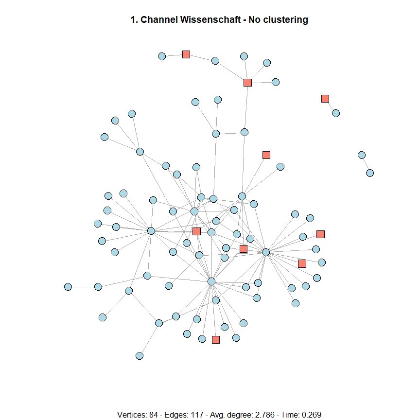
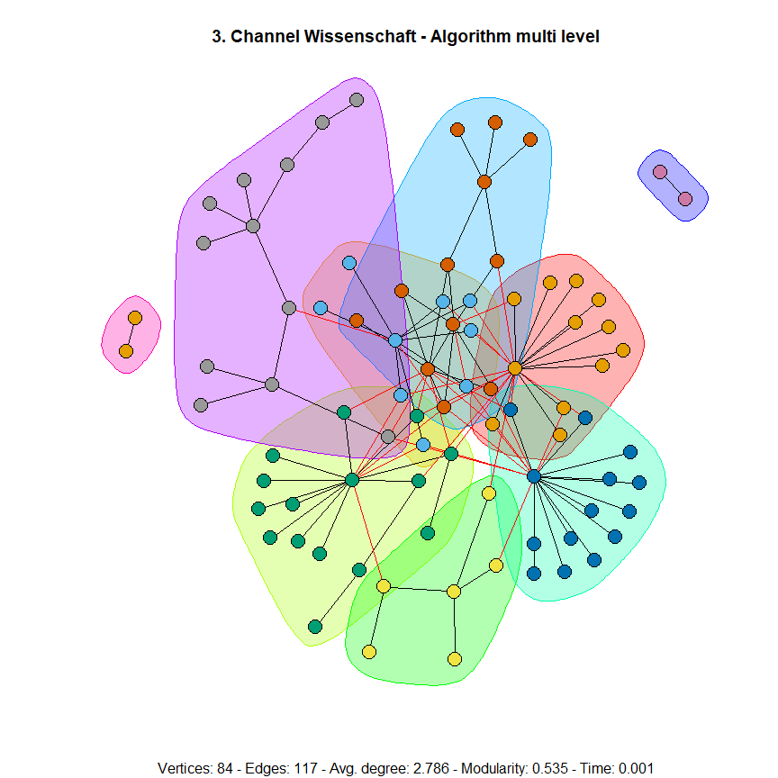
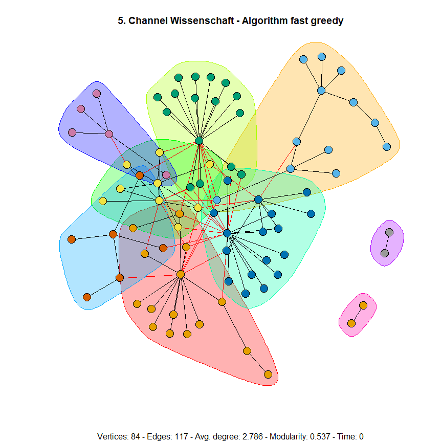
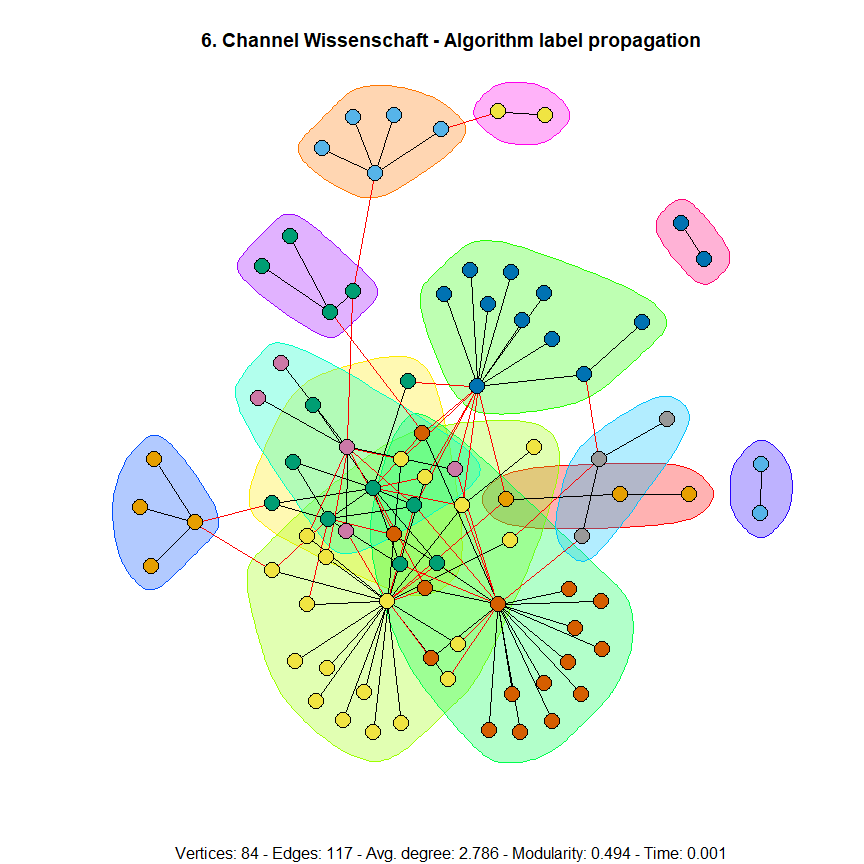
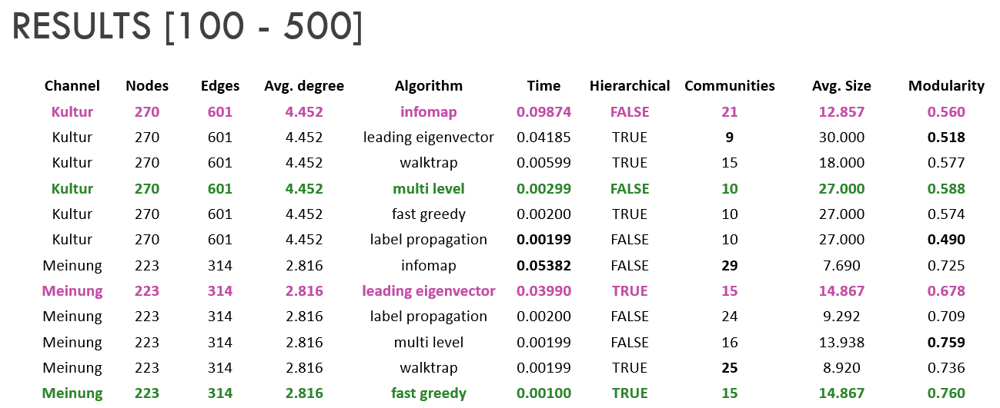

# Community Detection Analysis of derStandard.at User Interactions


## Project Overview

This project focuses on uncovering social structures and user behavior patterns within **derStandard.at** by applying advanced network analysis techniques.  
Through the use of multiple community detection algorithms and efficient data processing pipelines, it enhances content targeting and engagement strategies.

## Key Contributions

- **Led Community Detection Analysis**: Conducted in-depth analysis of user interactions to identify key communities and social trends.
- **Applied Multiple Algorithms**: Utilized six different network analysis algorithms to detect and map user communities, uncovering important engagement and behavior patterns.
- **Enhanced Insights**: Improved understanding of active user groups, supporting better content targeting and engagement strategies.
- **Automated Data Pipelines**: Developed and automated data workflows using **R**, **igraph**, and **dplyr** to process large-scale datasets reliably and efficiently.

## Architecture
```text
+---------------------------+      +---------------------------+     +---------------------------+     +---------------------------+      +---------------------------+
|  User Interaction Dataset | -->  |    Data Cleaning (dplyr)  | --> |  Graph Creation (igraph)  | --> |  Community Detection      | -->  |    Insights & Reports     |
|                           |      |                           |     |                           |     | (6 Network Algorithms)    |      |                           |
+---------------------------+      +---------------------------+     +---------------------------+     +---------------------------+      +---------------------------+
```

## Business Impact

- **Optimized Content Strategy**: Provided deeper insights into active user communities, enabling more targeted and engaging content.
- **Supported Data-Driven Decision Making**: Empowered marketing and content teams with actionable intelligence to optimize user engagement.

## Results
* Here are some output plots based on small dataset, that show detected communities using the menttioned algorithms. For more information, you can have a look at the [report](https://www.overleaf.com/read/fgqqbqstwypq) and [R Markdown document](doc/Community-Detection_smal_dataset.md).


<table>
<tr> <td>

</td>
<td>  </td>
 <td>  </td>
</tr>
 <tr> <td>

</td>
<td>  </td>
 <td>  </td>
</tr>
</table>

* For channel categories with 100- 500 nodes, the following table shows comparative scores by using the above mentioned six algorithms:


 

## Final Report Overleaf

https://www.overleaf.com/read/fgqqbqstwypq
