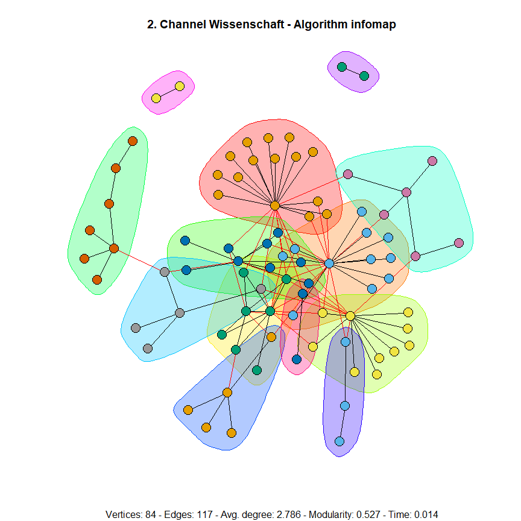
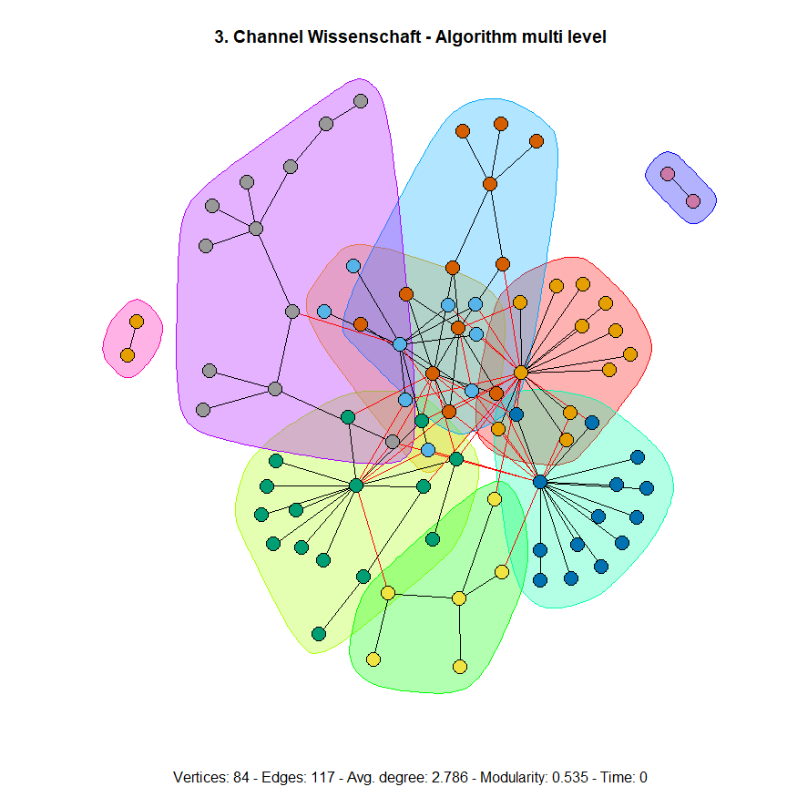
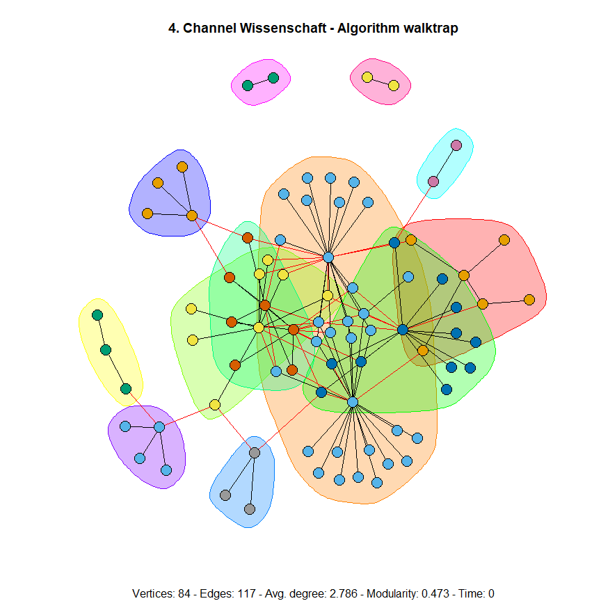

# SNA
Empirical Analysis of Social Network Data with a focus on comparing six community detection algorithms:
* Fastgreedy
* Label Propagation
* Label Propagation
* Infomap
* Multilevel
* Walktrap

<table>
<tr> <td>

</td>
<td>  </td>
 <td>  </td>
</tr>
 <tr> <td>

</td>
<td>  </td>
 <td>  </td>
</tr>
</table>

## Final Report Overleaf

https://www.overleaf.com/read/fgqqbqstwypq
